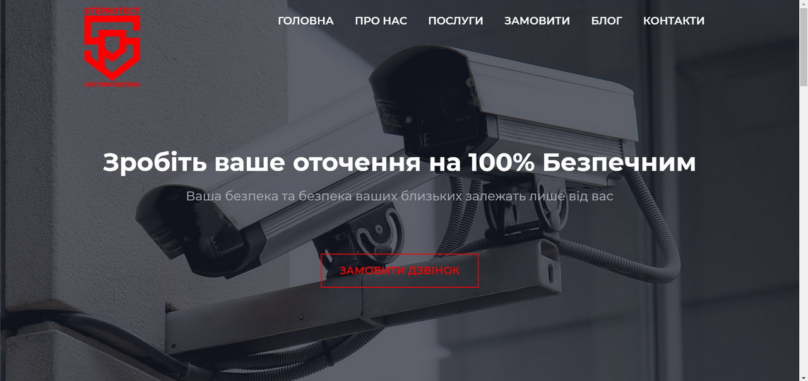

## SteProtect - системи безпеки
MERN app for the company that provides security services

## Libraries and dependencies used

* [React](https://reactjs.org/)
* [React Router](https://reactrouter.com/)
* [Redux](https://redux.js.org/)
* [React Redux](https://react-redux.js.org/)
* [Redux Thunk](https://github.com/reduxjs/redux-thunk)
* [Reselect](https://github.com/reduxjs/reselect)
* [Formik](https://formik.org/)
* [Bootstrap 4](https://getbootstrap.com/)
* [reactstrap](https://reactstrap.github.io/)
* [react-spinners](https://www.npmjs.com/package/react-spinners)
* [react-slick](https://react-slick.neostack.com/)
* [express](https://expressjs.com/)
* [nodemailer](https://nodemailer.com/)
* [googleapis](https://github.com/googleapis/google-api-nodejs-client)
* [mongoose](https://mongoosejs.com/)
* [dotenv](https://github.com/motdotla/dotenv)
* [Ramda](https://ramdajs.com/)